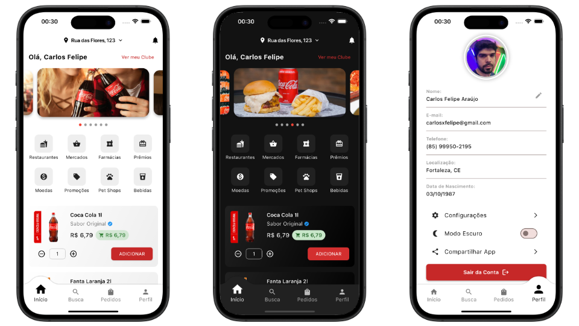

# iDrink

Bem-vindo ao **iDrink**! 🍹

<p align="center">
  
</p>

## Sobre o Projeto

Este projeto foi criado porque eu estava entediado e não queria esquecer como era codar no Flutter. Não há grandes pretensões aqui, apenas uma maneira de manter a prática e experimentar ideias.

O **iDrink** é essencialmente um aplicativo similar ao iFood, mas sem grandes funcionalidades no momento. Quem sabe no futuro algo útil surja daqui? 🤷

## Estrutura do Projeto

O projeto segue a estrutura padrão de um aplicativo Flutter multiplataforma, incluindo suporte para Android, iOS, Web, Windows, Linux e macOS. Alguns diretórios principais incluem:

- **lib/**: Contém a lógica do aplicativo, telas, widgets e roteamento.
- **android/** e **ios/**: Configurações específicas das plataformas móveis.
- **web/**, **linux/**, **macos/** e **windows/**: Suporte para outras plataformas.
- **assets/**: Arquivos estáticos, como imagens e ícones.

## Como Rodar

Caso queira rodar por curiosidade, basta ter o Flutter instalado e executar:

```sh
flutter pub get
flutter run
```

Se quiser rodar para uma plataforma específica, use:

```sh
flutter run -d <plataforma>
```

Exemplo:

```sh
flutter run -d android
flutter run -d chrome
```

## Contribuição

Se por algum motivo insano você quiser contribuir, fique à vontade! Abra um PR ou sugira melhorias. Mas lembre-se, este é apenas um projeto casual. 😆

## Licença

Sinta-se livre para fazer o que quiser com este código. Sem garantias, sem suporte, apenas código por diversão.

---

Se você leu até aqui, talvez seja hora de pedir um drink. 🍸
